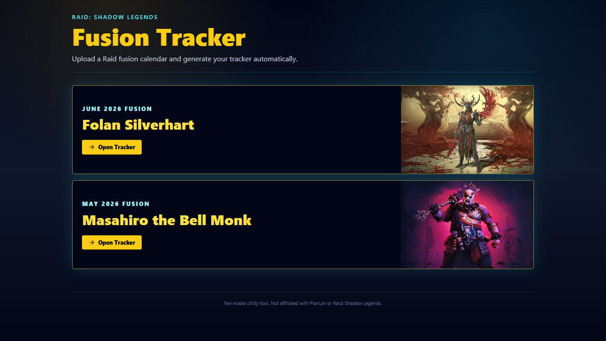
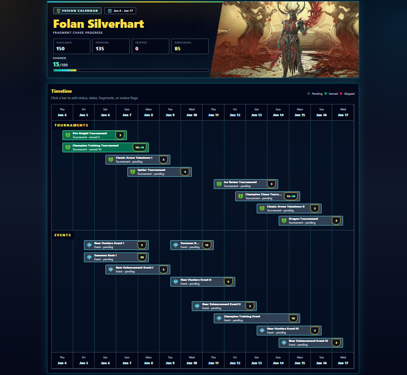

<div align="center">

# RSL Fusion Tracker

### Raid: Shadow Legends Fusion Event Tracker

A tracker for Raid: Shadow Legends fusion calendars where players can open ready-made fusion timelines, track tournament and event fragments, review leaderboard rewards, mark progress as pending, earned, or skipped, and manage calendar data from a protected admin workspace.

[](https://fusion-tracker.vercel.app/tracker)
[](https://nextjs.org/)
[](https://react.dev/)
[](https://www.typescriptlang.org/)
[](https://tailwindcss.com/)

</div>

---

## Preview

<p align="center">
  
</p>

<p align="center">
  
</p>

> **Live Site:** [https://fusion-tracker.vercel.app/tracker](https://fusion-tracker.vercel.app/tracker)

---

## Features

| Feature                    | Description                                                                                                                       |
| :------------------------- | :-------------------------------------------------------------------------------------------------------------------------------- |
| **Preset Fusion Trackers** | Open ready-made trackers for current and recent Raid fusion champions such as Folan Silverhart and Masahiro the Bell Monk.        |
| **Interactive Timeline**   | View tournaments and events in separate timeline lanes with dates, fragment rewards, leaderboard rewards, and review states.      |
| **Progress Tracking**      | Calculate earned, skipped, pending, remaining, possible final fragments, completion percentage, and risk status.                  |
| **Event Status Updates**   | Mark each event as pending, earned, or skipped and keep the tracker state persisted in the browser.                               |
| **Protected Admin Area**   | Sign in to an admin workspace for uploading calendars, loading presets, editing tracker details, and managing events.             |
| **Manual Event Editing**   | Add, edit, delete, and review fusion events from the admin tracker dashboard.                                                     |
| **Import and Export JSON** | Back up tracker data or restore a tracker from validated JSON.                                                                    |
| **Local Persistence**      | Store tracker progress in `localStorage` using the `rsl-ai-fusion-tracker` key.                                                   |
| **PWA Ready**              | Includes a web app manifest, service worker file, install prompt component, app icons, and shortcuts.                             |
| **SEO Metadata**           | Ships with Open Graph, Twitter card, structured data, sitemap, robots metadata, and production site URL support.                  |
| **Fan-Made Raid UI**       | Dark fantasy-inspired interface with cyan/yellow accents, champion artwork, timeline grids, glow effects, and responsive layouts. |

---

## Tech Stack

|      Technology       | Purpose                                                                                     |
| :-------------------: | :------------------------------------------------------------------------------------------ |
|    **Next.js 15**     | App Router, pages, metadata, API routes, server-side route handling, and Vercel deployment. |
|     **React 19**      | Component-driven upload, tracker, admin, modal, and dashboard interfaces.                   |
|   **TypeScript 5**    | Strong tracker, event, API, and utility types.                                              |
|  **Tailwind CSS 3**   | Utility-first styling, responsive layouts, custom theme colors, and visual polish.          |
|   **Lucide React**    | Consistent icons for upload, actions, loading, reset, and admin controls.                   |
|        **Zod**        | AI output validation and schema-safe fusion tracker normalization.                          |
|    **Ollama API**     | Vision-model calendar extraction from uploaded fusion calendar images.                      |
|  **Web Storage API**  | Browser-side tracker persistence without a database.                                        |
| **Next Metadata API** | SEO, PWA manifest, sitemap, robots, Open Graph, and structured application data.            |
|      **Vercel**       | Production hosting for the deployed tracker.                                                |

## Design Highlights

- **Champion-first landing flow** with large fusion cards, event artwork, bold Raid-inspired typography, and direct tracker entry.
- **Timeline dashboard** with separate Tournament and Event lanes, date alignment, compact event bars, and clear status language.
- **Progress panel logic** that identifies completed, on-track, at-risk, and needs-review tracker states.
- **Admin editor layout** with calendar details, progress summary, import/export tools, event modal editing, and reset actions.
- **Upload experience** with drag-and-drop image selection, preview, type validation, 20MB limit, processing states, and helpful AI failure messages.
- **Dark fantasy visual system** using slate backgrounds, cyan borders, yellow highlights, subtle glow, grid textures, and responsive spacing.
- **PWA polish** with install prompt support, app manifest shortcuts, logo icons, and standalone display mode.

---

## Client Tracker Storage

Tracker progress is stored in the browser:

```text
localStorage key: rsl-ai-fusion-tracker
```

| Data Shape      | Purpose                                                                                                       |
| :-------------- | :------------------------------------------------------------------------------------------------------------ |
| `FusionTracker` | Fusion name, date range, required fragments, total fragments, source, timestamps, and event list.             |
| `FusionEvent`   | Event name, type, dates, fragments, leaderboard fragments, earned fragments, status, notes, and review state. |

---

<div align="center">

**If you found this project useful, consider giving it a star.**

Made with Next.js, React, TypeScript, Tailwind CSS, Zod, Ollama, and Vercel.

</div>
